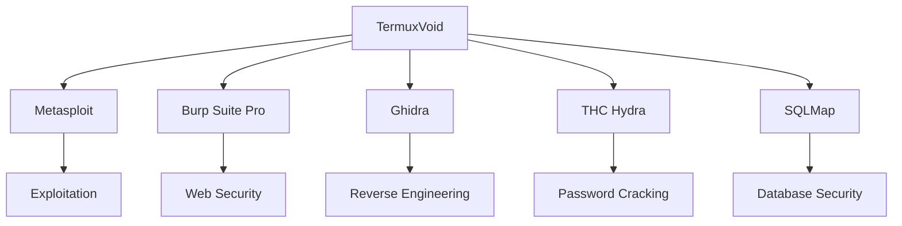

<div align="center">
  <a href="https://termuxvoid.github.io/">
    
    <h1>TermuxVoid APT Repository</h1>
  </a>
  <p>Advanced Security Tools for Termux - Beyond Official Repositories</p>
  
  <div>
    <a href="https://github.com/TermuxVoid/repo/stargazers">
      
    </a>
    <a href="https://github.com/TermuxVoid/repo/blob/main/LICENSE">
      
    </a>
  </div>
</div>

## 🔍 Project Overview

**TermuxVoid** provides optimized security tools for Termux with enhanced performance and reliability.



## ✨ Featured Tools

<div align="center">

| Tool | Category | Description |
|------|----------|-------------|
| **Metasploit Framework** | Exploitation | Industry-standard penetration testing tool |
| **Burp Suite** | Web Security | Professional web vulnerability scanner |
|  **Ghidra** | Reverse Engineering | NSA's reverse engineering framework |
| **THC Hydra** | Password Cracking | Network login cracker |
| **SQLMap** | Web Security | Automated SQL injection tool |

</div>

## 🚀 Quick Start

# Add repository
```bash
curl -sL https://termuxvoid.github.io/repo/install.sh | bash
```
# Install tools
```bash
pkg install <tool name>
```

## ❓ FAQ

<details>
<summary><b>Are these tools legal to use?</b></summary>
All tools are provided for <b>legal security research and ethical hacking purposes only</b>. Always obtain proper authorization before testing systems.
</details>

<details>
<summary><b>How often are tools updated?</b></summary>
We provide weekly updates with:
<ul>
  <li>Security patches within 24 hours</li>
  <li>Version updates every Sunday</li>
  <li>Emergency fixes as needed</li>
</ul>
</details>

<details>
<summary><b>Can I request new tools?</b></summary>
Yes! Submit requests via:
<ul>
  <li>GitHub Issues</li>
  <li>Telegram @nullxvoid</li>
  <li>Email: termuxvoid@proton.me</li>
</ul>
</details>

## 🌐 Support & Community

<div align="center">
  <a href="https://t.me/nullxvoid">
    
  </a>
  <a href="https://youtube.com/@alienkrishnorg">
    
  </a>
  <a href="https://github.com/TermuxVoid/repo/issues">
    
  </a>
</div>

## 🛠️ Our Work

Support the project:
- ⭐ Star this repository
- 🐛 Report issues responsibly
- 📢 Share with security communities
- 💰 Join us on Telegram @nullxvoid

[View Complete Package List »](PACKAGES.md)

<div align="center">
  <sub>Built with ❤️ for security researchers | Termux-optimized builds</sub>
</div>
